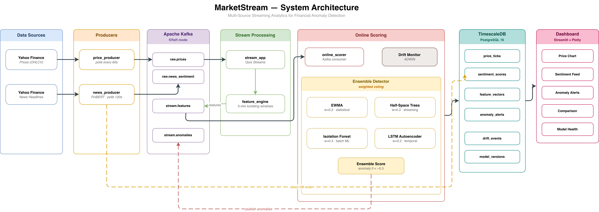
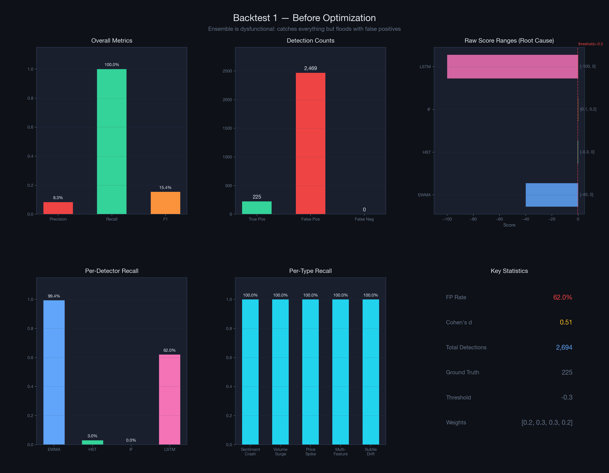
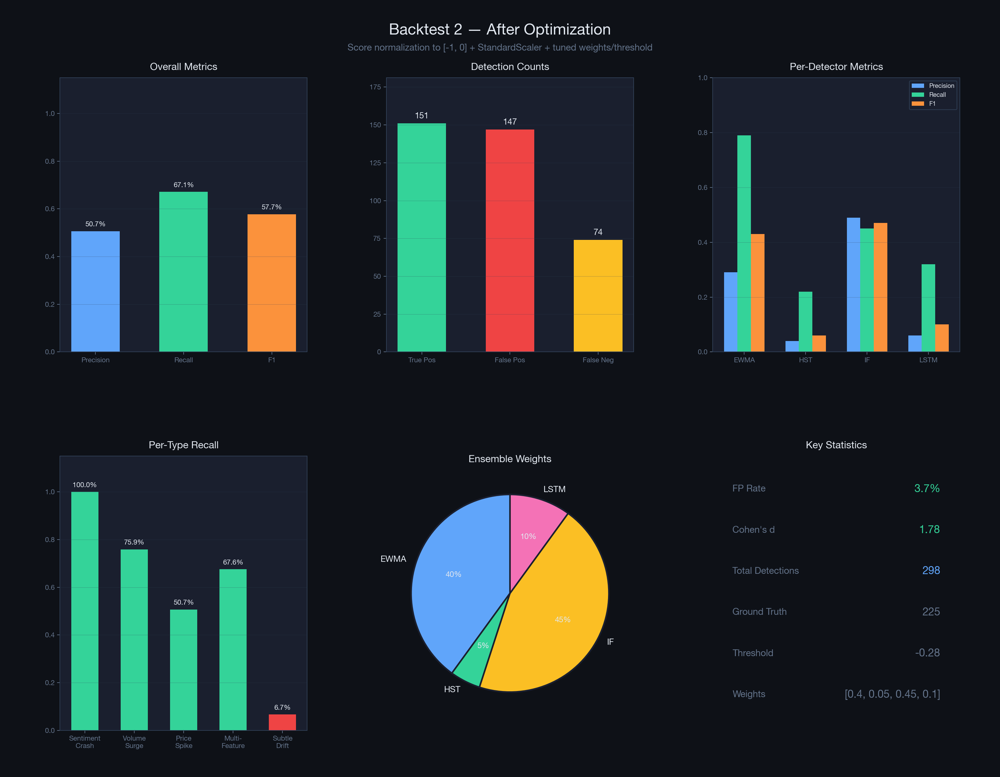
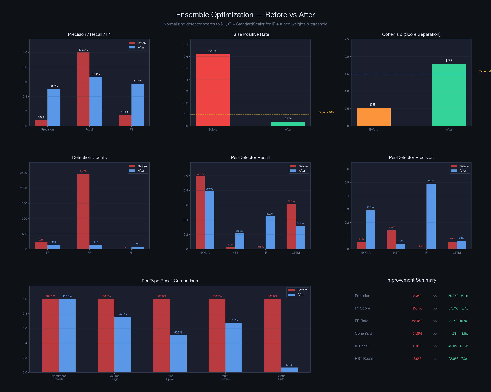

# MarketStream

Multi-Source Streaming Analytics Platform for Financial Trends and Anomaly Detection

A real-time streaming platform that detects financial market anomalies by combining price data and news sentiment through a four-algorithm ensemble system. Built with Apache Kafka, TimescaleDB, and Streamlit.

**Tracked tickers:** AAPL, TSLA, NVDA

---

## System Architecture



The system consists of five independently-running Python processes connected by Apache Kafka:

| Component | Role |
|-----------|------|
| **price_producer** | Polls Yahoo Finance every 60s for OHLCV data, produces to Kafka |
| **news_producer** | Polls news every 120s, runs FinBERT sentiment scoring, writes to Kafka + DB |
| **stream_app** | Quix Streams consumer — aggregates prices into 5-min tumbling windows, computes features |
| **online_scorer** | Enriches features with sentiment, runs 4-detector ensemble, writes results to DB |
| **Dashboard** | Streamlit app — reads from TimescaleDB, auto-refreshes every 5-10s |

---

## Ensemble Anomaly Detection

Instead of relying on a single algorithm, the system combines four detection methods through weighted voting. Each detector brings a different strength:

| Detector | Type | Weight | What it catches |
|----------|------|--------|----------------|
| **EWMA** | Statistical | 0.40 | Sudden single-feature spikes (z-score based) |
| **Half-Space Trees** | Streaming ML | 0.05 | Multivariate anomalies, adapts to distribution shifts in real time |
| **Isolation Forest** | Batch ML | 0.45 | Global outliers based on historical patterns (with StandardScaler) |
| **LSTM Autoencoder** | Deep Learning | 0.10 | Temporal sequence anomalies (unusual trends over time) |

All detectors normalize their scores to the [-1, 0] range (0 = normal, -1 = maximum anomaly). The ensemble score is a weighted average. If the score falls below -0.28, the observation is flagged as an anomaly.

---

## Model Maintenance (MLOps)

- **Drift Detection**: ADWIN monitors feature distributions per ticker. When market conditions shift, drift events are logged to the database.
- **Model Retraining**: IsolationForest supports scheduled retraining with versioned model files and a database-backed model registry.
- **Adaptive Detectors**: EWMA and HST continuously update with each new observation — they adapt to changing markets without explicit retraining.

---

## Backtest Results

We evaluated the ensemble on 60 days of historical data with 5% synthetic anomaly injection (price spikes, volume surges, sentiment crashes, multi-feature events, and subtle drift).

### Backtest 1 — Before Optimization

The initial ensemble was dysfunctional: detectors produced incompatible score scales (EWMA: [-40, 0], LSTM: [-100, 0], IF: [+0.1, +0.2], HST: [-0.3, 0]). EWMA's unbounded z-scores dominated the average, resulting in near-100% recall but massive false positive flooding.



| Metric | Value |
|--------|-------|
| **Precision** | 8.35% |
| **Recall** | 100% |
| **F1 Score** | 0.154 |
| **False Positives** | 2,469 |
| **FP Rate** | 62% |
| **Cohen's d** | 0.51 |

### Backtest 2 — After Optimization

We normalized all detector scores to [-1, 0], added StandardScaler for Isolation Forest, and tuned weights to favor the strongest detectors (EWMA + IF = 85% weight).



| Metric | Value |
|--------|-------|
| **Precision** | 50.67% |
| **Recall** | 67.11% |
| **F1 Score** | 0.577 |
| **False Positives** | 147 |
| **FP Rate** | 3.69% |
| **Cohen's d** | 1.78 |

### Before vs After Comparison



| Metric | Before | After | Improvement |
|--------|--------|-------|-------------|
| **Precision** | 8.35% | 50.67% | 6.1x |
| **F1 Score** | 0.154 | 0.577 | 3.7x |
| **FP Rate** | 62.0% | 3.69% | 16.8x reduction |
| **Cohen's d** | 0.51 | 1.78 | 3.5x |
| **IF Recall** | 0% | 45% | Was dead, now functional |
| **HST Recall** | 3% | 22% | 7.3x |

### Drift Detection

The backtest includes a simulated distribution shift at index 3367 (out of 4209 data points). ADWIN detected 37 drift events during the replay, with detection latencies of 88 windows for volume features and 182 windows for sentiment features.

---

## Dashboard Pages

| Page | Description |
|------|-------------|
| **Home** | System health, data freshness per ticker, anomaly count |
| **Price Chart** | Interactive price chart with anomaly markers |
| **Sentiment Feed** | Real-time news headlines with sentiment scores |
| **Anomaly Alerts** | Alert list with feature breakdown and per-detector scores |
| **Comparison** | Cross-ticker comparison view |
| **Model Health** | Model registry, drift events timeline, anomaly rate trends, detector agreement |

---

## Tech Stack

| Layer | Technology |
|-------|-----------|
| Message Broker | Apache Kafka 3.9.0 (KRaft mode) |
| Database | TimescaleDB (PostgreSQL 16) |
| Stream Processing | Quix Streams |
| ML — Statistical | EWMA (NumPy) |
| ML — Batch | Isolation Forest (scikit-learn) |
| ML — Streaming | Half-Space Trees (river) |
| ML — Deep Learning | LSTM Autoencoder (PyTorch) |
| NLP | FinBERT (Hugging Face Transformers) |
| Drift Detection | ADWIN (river) |
| Dashboard | Streamlit + Plotly |

---

## Project Structure

```
├── config/              # Settings (pydantic-settings) and logging
├── producers/           # Data ingestion (prices + news with FinBERT)
├── processing/          # Quix Streams windowed aggregation + feature engine
├── ml/
│   ├── detector.py          # Isolation Forest (BaseDetector)
│   ├── detectors/           # EWMA, HST, LSTM Autoencoder
│   ├── ensemble.py          # Weighted voting ensemble
│   ├── drift_monitor.py     # ADWIN concept drift detection
│   ├── retrain.py           # Model retraining with versioning
│   ├── backtest.py          # Offline backtesting framework
│   ├── train_baseline.py    # Isolation Forest training
│   └── train_lstm.py        # LSTM Autoencoder training
├── storage/             # SQLAlchemy models, TimescaleDB init
├── dashboard/           # Streamlit multi-page app (6 pages)
├── tests/               # Unit tests (50 tests)
├── docs/                # Literature review, architecture, project plan
├── scripts/             # Startup, topic creation
└── docker-compose.yml   # Kafka + TimescaleDB + Kafka-UI
```

---

## Quick Start

```bash
# Install dependencies
uv sync

# Start infrastructure
docker-compose up -d
bash scripts/create_topics.sh
uv run python -m storage.init_db

# Train models
uv run python -m ml.train_baseline    # Isolation Forest
uv run python -m ml.train_lstm        # LSTM Autoencoder

# Run backtest (optional)
uv run python -m ml.backtest

# Start the full pipeline
bash scripts/start_all.sh

# Access dashboard at http://localhost:8501
```

---

## Testing

```bash
uv run pytest tests/ -v     # 62 tests
uv run ruff check .         # Lint
```
