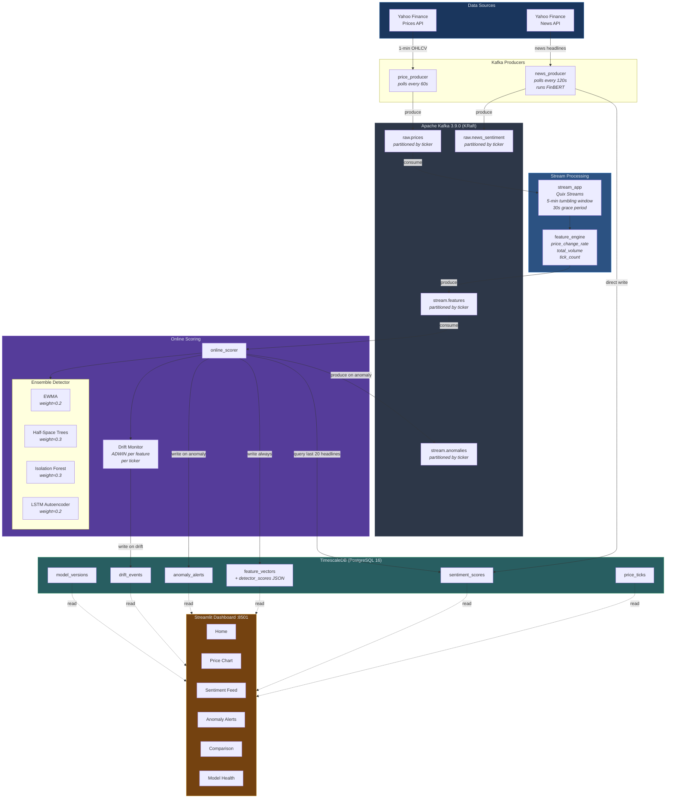

# MarketStream Architecture

**Multi-Source Streaming Analytics Platform for Financial Trends and Anomaly Detection**

This document describes the end-to-end architecture of MarketStream, a real-time streaming financial analytics platform that ingests market prices and news headlines, computes windowed features, runs an ensemble of four anomaly detection algorithms, monitors for concept drift, and surfaces results through an interactive dashboard.

---

## Table of Contents

1. [System Overview](#system-overview)
2. [Data Flow Diagram](#data-flow-diagram)
3. [Component Descriptions](#component-descriptions)
4. [Kafka Topic Schemas](#kafka-topic-schemas)
5. [Ensemble Anomaly Detector](#ensemble-anomaly-detector)
6. [Model Maintenance Loop](#model-maintenance-loop)
7. [Database Schema](#database-schema)
8. [Dashboard](#dashboard)
9. [Technology Selection Rationale](#technology-selection-rationale)
10. [Deployment](#deployment)

---

## System Overview

MarketStream is composed of five independently-running Python processes connected by Apache Kafka, with TimescaleDB as the persistent store and a Streamlit dashboard as the presentation layer. The system tracks three tickers (AAPL, TSLA, NVDA) by default and is configurable via environment variables or a `.env` file through Pydantic Settings.

| Layer              | Technology                                  |
|--------------------|---------------------------------------------|
| Data Ingestion     | yfinance, FinBERT (HuggingFace Transformers)|
| Message Broker     | Apache Kafka 3.9.0 (KRaft mode)             |
| Stream Processing  | Quix Streams (tumbling windows)             |
| Anomaly Detection  | EWMA, Half-Space Trees, Isolation Forest, LSTM Autoencoder |
| Drift Detection    | ADWIN (river library)                       |
| Storage            | TimescaleDB (PostgreSQL 16 + hypertables)   |
| Dashboard          | Streamlit + Plotly (dark theme)             |
| Configuration      | Pydantic Settings, docker-compose           |

---

## Data Flow Diagram



---

## Component Descriptions

### 1. price_producer (`producers/price_producer.py`)

Polls Yahoo Finance every 60 seconds for the latest 1-minute OHLCV bar for each configured ticker. Each record is serialized to JSON and produced to the `raw.prices` Kafka topic, keyed by ticker symbol. Includes exponential-backoff retry logic (up to 3 attempts).

### 2. news_producer (`producers/news_producer.py`)

Polls Yahoo Finance news every 120 seconds. Each headline is run through the ProsusAI/FinBERT transformer model for sentiment classification. The raw FinBERT score is in [0, 1]; negatives are inverted so the final `sentiment_score` falls in [-1, 1]. Records are written to both the `raw.news_sentiment` Kafka topic and directly to the TimescaleDB `sentiment_scores` table. An in-memory `OrderedDict` (capacity 1000) deduplicates headlines across poll cycles.

### 3. stream_app (`processing/stream_app.py`)

A Quix Streams application that consumes `raw.prices` and applies 5-minute tumbling windows with a 30-second grace period. Within each window, a reducer accumulates close prices and volumes. When a window closes, the feature_engine computes derived features and the result is produced to `stream.features`.

### 4. feature_engine (`processing/feature_engine.py`)

Pure function module that computes windowed features from aggregated price data:

| Feature            | Computation                                              |
|--------------------|----------------------------------------------------------|
| `price_change_rate`| `(last_close - first_close) / first_close`               |
| `total_volume`     | Sum of all volume values in the window                   |
| `tick_count`       | Number of price ticks received in the window             |
| `avg_close`        | Arithmetic mean of all close prices in the window        |

### 5. online_scorer (`ml/online_scorer.py`)

Consumes `stream.features`, enriches each feature vector with sentiment data by querying the last 20 headlines from TimescaleDB (with a 60-second cache TTL), and passes the enriched vector through the ensemble anomaly detector. Results are written to the `feature_vectors` table on every observation. When an anomaly is detected, an `AnomalyAlert` row is inserted and a message is produced to `stream.anomalies`. The drift monitor is also updated on every observation.

### 6. Streamlit Dashboard (`dashboard/`)

Multi-page dashboard that reads exclusively from TimescaleDB (never Kafka). Auto-refreshes using `@st.fragment` decorators at 5--10 second intervals. All Plotly charts share a dark theme layout with transparent backgrounds and the Space Grotesk font family.

| Page             | File                              | Purpose                                          |
|------------------|-----------------------------------|--------------------------------------------------|
| Home             | `dashboard/app.py`                | Overview metrics and system status               |
| Price Chart      | `dashboard/pages/1_Price_Chart.py`| Interactive OHLCV candlestick chart              |
| Sentiment Feed   | `dashboard/pages/2_Sentiment_Feed.py`| Real-time sentiment scores and headlines      |
| Anomaly Alerts   | `dashboard/pages/3_Anomaly_Alerts.py`| Alert feed with per-detector score breakdown  |
| Comparison       | `dashboard/pages/4_Comparison.py` | Cross-ticker comparison views                    |
| Model Health     | `dashboard/pages/5_Model_Health.py`| Drift events, model versions, score distributions|

---

## Kafka Topic Schemas

All messages are JSON-serialized and keyed by ticker symbol (UTF-8 encoded string).

### `raw.prices`

Produced by `price_producer` every 60 seconds per ticker.

```json
{
  "ticker": "AAPL",
  "timestamp": "2026-05-09T14:30:00-04:00",
  "open": 198.1200,
  "high": 198.4500,
  "low": 197.9800,
  "close": 198.3100,
  "volume": 1523400
}
```

| Field       | Type   | Description                                 |
|-------------|--------|---------------------------------------------|
| `ticker`    | string | Stock symbol (e.g., AAPL, TSLA, NVDA)       |
| `timestamp` | string | ISO-8601 timestamp of the 1-min bar         |
| `open`      | float  | Opening price, rounded to 4 decimal places  |
| `high`      | float  | Highest price in the bar                     |
| `low`       | float  | Lowest price in the bar                      |
| `close`     | float  | Closing price, rounded to 4 decimal places  |
| `volume`    | int    | Number of shares traded in the bar          |

### `raw.news_sentiment`

Produced by `news_producer` every 120 seconds per ticker, after FinBERT scoring.

```json
{
  "ticker": "TSLA",
  "timestamp": "2026-05-09T18:32:15.123456+00:00",
  "headline": "Tesla announces new battery technology partnership",
  "source": "Reuters",
  "sentiment_score": 0.8734,
  "sentiment_label": "positive"
}
```

| Field             | Type   | Description                                        |
|-------------------|--------|----------------------------------------------------|
| `ticker`          | string | Stock symbol                                       |
| `timestamp`       | string | ISO-8601 UTC timestamp of when scoring occurred    |
| `headline`        | string | Full article headline text                         |
| `source`          | string | News publisher name                                |
| `sentiment_score` | float  | FinBERT sentiment in [-1, 1] (negative inverted)   |
| `sentiment_label` | string | One of: `positive`, `negative`, `neutral`          |

### `stream.features`

Produced by `stream_app` when a 5-minute tumbling window closes.

```json
{
  "ticker": "NVDA",
  "window_start": 1715270400000,
  "window_end": 1715270700000,
  "avg_close": 875.2350,
  "first_close": 874.1200,
  "last_close": 876.3500,
  "price_change_rate": 0.002552,
  "total_volume": 4812300,
  "tick_count": 5
}
```

| Field               | Type   | Description                                         |
|---------------------|--------|-----------------------------------------------------|
| `ticker`            | string | Stock symbol                                        |
| `window_start`      | int    | Window start as epoch milliseconds                  |
| `window_end`        | int    | Window end as epoch milliseconds                    |
| `avg_close`         | float  | Mean close price across the window                  |
| `first_close`       | float  | Close price of the first tick in the window         |
| `last_close`        | float  | Close price of the last tick in the window          |
| `price_change_rate` | float  | `(last_close - first_close) / first_close`          |
| `total_volume`      | int    | Summed volume across all ticks in the window        |
| `tick_count`        | int    | Number of price ticks received in the window        |

### `stream.anomalies`

Produced by `online_scorer` only when an anomaly is detected.

```json
{
  "ticker": "AAPL",
  "anomaly_score": -0.4521,
  "is_anomaly": true,
  "features": {
    "ticker": "AAPL",
    "window_start": 1715270400000,
    "window_end": 1715270700000,
    "avg_close": 198.3100,
    "price_change_rate": 0.0312,
    "total_volume": 8523100,
    "avg_sentiment": -0.6200,
    "sentiment_shift": -0.4100,
    "headline_count": 7
  },
  "reason": "large price move (3.12%); sentiment shift (-0.41)",
  "detector_scores": {
    "ewma": -3.21,
    "hst": -0.62,
    "isolation_forest": -0.18,
    "lstm_ae": -0.09
  }
}
```

| Field             | Type   | Description                                         |
|-------------------|--------|-----------------------------------------------------|
| `ticker`          | string | Stock symbol                                        |
| `anomaly_score`   | float  | Weighted ensemble score (negative = anomalous)      |
| `is_anomaly`      | bool   | Always `true` (only anomalies are published)        |
| `features`        | object | Full enriched feature vector used for scoring       |
| `reason`          | string | Human-readable explanation of why anomaly triggered |
| `detector_scores` | object | Individual score from each detector in the ensemble |

---

## Ensemble Anomaly Detector

The scoring pipeline uses a weighted voting ensemble of four anomaly detectors. All detectors share a common interface (`BaseDetector`) with `score(features) -> float` and `update(features)` methods. Scores follow the convention: **lower (more negative) = more anomalous**. The ensemble threshold defaults to -0.3.

```
                    +------------------+
                    |  Enriched Feature|
                    |     Vector       |
                    +--------+---------+
                             |
          +------------------+------------------+
          |                  |                  |                  |
    +-----v-----+     +-----v-----+     +-----v-----+     +-----v-----+
    |   EWMA    |     |    HST    |     | Isolation  |     |   LSTM    |
    |  w = 0.2  |     |  w = 0.3  |     |  Forest    |     |Autoencoder|
    |           |     |           |     |  w = 0.3   |     |  w = 0.2  |
    +-----+-----+     +-----+-----+     +-----+-----+     +-----+-----+
          |                  |                  |                  |
          +------------------+------------------+------------------+
                             |
                    +--------v---------+
                    | Weighted Average |
                    |  (skip warm-up   |
                    |   neutral 0.0)   |
                    +--------+---------+
                             |
                    +--------v---------+
                    | score < -0.3 ?   |
                    | --> ANOMALY      |
                    +------------------+
```

### Detector Details

| Detector               | Module                            | Algorithm                          | Input Features                                                        | State                                         | Online Update |
|------------------------|-----------------------------------|------------------------------------|-----------------------------------------------------------------------|-----------------------------------------------|---------------|
| **EWMA**               | `ml/detectors/ewma_detector.py`   | Exponentially weighted mean/var, max z-score | `price_change_rate`, `total_volume`, `avg_sentiment`, `sentiment_shift` | Running mean + variance per feature per ticker | Yes           |
| **Half-Space Trees**   | `ml/detectors/hst_detector.py`    | Streaming Isolation Forest (river) | `price_change_rate`, `total_volume`, `avg_sentiment`, `sentiment_shift` | 25 trees, height 6, sliding window of 50      | Yes           |
| **Isolation Forest**   | `ml/detector.py`                  | scikit-learn batch ensemble        | `price_change_rate`, `total_volume`, `avg_sentiment`, `sentiment_shift` | Pre-trained model loaded from joblib           | No (retrained offline) |
| **LSTM Autoencoder**   | `ml/detectors/lstm_detector.py`   | PyTorch encoder-decoder, MSE loss  | `price_change_rate`, `total_volume`, `avg_sentiment`, `sentiment_shift` | 12-step sliding buffer per ticker             | Buffer only   |

**Scoring convention:**
- EWMA: returns `-max(z_scores)` across features. High z-scores produce strongly negative scores.
- HST: returns `-score_one(x)` from the river `HalfSpaceTrees` model.
- Isolation Forest: returns `decision_function()` directly. Positive = normal, negative = anomaly.
- LSTM Autoencoder: returns `-mse_loss(reconstructed, input)`. Returns 0.0 during warm-up (buffer not yet full).

**Warm-up handling:** The ensemble skips LSTM scores of exactly 0.0 during the warm-up phase (first 12 observations per ticker) and adjusts the weight denominator accordingly.

---

## Model Maintenance Loop

### ADWIN Drift Detection (`ml/drift_monitor.py`)

The system runs one ADWIN (ADaptive WINdowing) instance per monitored feature per ticker. Monitored features: `price_change_rate`, `total_volume`, `avg_sentiment`, `sentiment_shift`. Sensitivity is controlled by the `drift_sensitivity` parameter (default: 0.002). When drift is detected, a `DriftEvent` record is persisted to TimescaleDB with the feature name, ticker, and timestamp.

### Scheduled Retraining (`ml/retrain.py`)

The Isolation Forest detector supports scheduled retraining with full model versioning:

1. Downloads 30 days of historical price data for all configured tickers.
2. Computes feature columns and fits a new `IsolationForest(contamination=0.05, n_estimators=200)`.
3. Records training statistics (sample count, anomaly rate, score mean/std).
4. Saves the model with a versioned filename (e.g., `isolation_forest_v3.joblib`).
5. Marks the previous active version as inactive and registers the new version in the `model_versions` table.
6. Copies the new model to the canonical path (`data/models/isolation_forest.joblib`) for the online scorer to load on next restart.

### Model Registry

The `model_versions` table tracks every trained model with:
- Version number (auto-incrementing per model name)
- Training timestamp and data range
- Performance metrics (sample count, anomaly rate, score mean, score std)
- File path and active/inactive flag

---

## Database Schema

TimescaleDB extends PostgreSQL 16 with hypertable partitioning for time-series data. All hypertables use 1-day chunk intervals.

### Tables

| Table              | Hypertable | Partition Column | Primary Key            | Purpose                                |
|--------------------|------------|------------------|------------------------|----------------------------------------|
| `price_ticks`      | Yes        | `time`           | `(time, ticker)`       | Raw OHLCV price bars from yfinance     |
| `sentiment_scores` | Yes        | `time`           | `id` (auto)            | FinBERT sentiment per headline         |
| `feature_vectors`  | Yes        | `window_end`     | `(window_end, ticker)` | Windowed features + anomaly scores     |
| `anomaly_alerts`   | No         | --               | `id` (auto)            | Flagged anomaly events with reasons    |
| `drift_events`     | Yes        | `detected_at`    | `id` (auto)            | ADWIN drift detection events           |
| `model_versions`   | No         | --               | `id` (auto)            | Model registry for retraining history  |

### Entity Relationship

```
price_ticks                    sentiment_scores
+------------+                 +------------------+
| time (PK)  |                 | id (PK)          |
| ticker (PK)|                 | time             |
| open       |                 | ticker           |
| high       |                 | headline         |
| low        |                 | source           |
| close      |                 | sentiment_score  |
| volume     |                 | sentiment_label  |
+------------+                 +------------------+

feature_vectors                anomaly_alerts
+-------------------+          +------------------+
| window_end (PK)   |          | id (PK)          |
| ticker (PK)       |          | detected_at      |
| window_start      |          | ticker           |
| avg_close         |          | anomaly_score    |
| price_change_rate |          | features (JSON)  |
| total_volume      |          | reason           |
| avg_sentiment     |          | detector_scores  |
| sentiment_shift   |          |    (JSON)        |
| headline_count    |          +------------------+
| anomaly_score     |
| is_anomaly        |          drift_events
| detector_scores   |          +------------------+
|    (JSON)         |          | id (PK)          |
+-------------------+          | detected_at      |
                               | ticker           |
model_versions                 | feature_name     |
+-------------------+          | drift_type       |
| id (PK)           |          | details (JSON)   |
| model_name        |          +------------------+
| version           |
| trained_at        |
| training_data_start|
| training_data_end |
| sample_count      |
| anomaly_rate      |
| score_mean        |
| score_std         |
| model_path        |
| is_active         |
| metadata (JSON)   |
+-------------------+
```

---

## Dashboard

The dashboard is a multi-page Streamlit application accessible at `http://localhost:8501`. It reads from TimescaleDB only and never consumes from Kafka. Each page auto-refreshes using `@st.fragment` decorators at 5--10 second intervals.

All charts use a shared Plotly dark theme:

```python
PLOTLY_LAYOUT = dict(
    template="plotly_dark",
    paper_bgcolor="rgba(0,0,0,0)",
    plot_bgcolor="rgba(0,0,0,0)",
    font=dict(family="Space Grotesk, sans-serif", color="#e2e8f0"),
    xaxis=dict(gridcolor="#314158", zerolinecolor="#314158"),
    yaxis=dict(gridcolor="#314158", zerolinecolor="#314158"),
)
```

---

## Technology Selection Rationale

### Anomaly Detection Algorithms

| Algorithm            | Why Selected                                                                                                         | Alternatives Considered                          | Why Not Alternative                                                                                      |
|----------------------|----------------------------------------------------------------------------------------------------------------------|--------------------------------------------------|----------------------------------------------------------------------------------------------------------|
| **EWMA**             | Zero-dependency statistical baseline. Extremely fast, interpretable, and naturally adapts to non-stationary data via exponential weighting. Good at catching sudden single-feature spikes. | Simple moving average, Bollinger Bands           | Fixed-window averages adapt too slowly; Bollinger Bands assume normal distribution and lack multivariate support. |
| **Half-Space Trees** | True streaming algorithm with O(1) memory per tree. Updates incrementally without batch retraining, making it ideal for continuous data. Captures multivariate interactions that EWMA misses. | Online Random Forest, LODA                       | Online RF requires labels (supervised); LODA has weaker empirical performance on mixed-type financial features. |
| **Isolation Forest** | Industry-standard unsupervised anomaly detector. Strong baseline performance, well-understood contamination parameter, and deterministic scoring on pre-trained models. | One-Class SVM, Local Outlier Factor (LOF)        | One-Class SVM scales poorly with data size (O(n^2) kernel); LOF requires storing all training points and is sensitive to the k parameter. |
| **LSTM Autoencoder** | Captures temporal dependencies across 12-step sequences that point-wise detectors miss. Reconstruction error naturally surfaces anomalous temporal patterns (e.g., sustained unusual activity). | Transformer Autoencoder, TCN, GRU Autoencoder    | Transformers are heavier with little benefit at sequence length 12; TCN lacks proven anomaly detection track record; GRU is viable but LSTM is more established for financial time-series. |

### Infrastructure Components

| Component          | Why Selected                                                                                                         | Alternatives Considered                          | Why Not Alternative                                                                                      |
|--------------------|----------------------------------------------------------------------------------------------------------------------|--------------------------------------------------|----------------------------------------------------------------------------------------------------------|
| **Apache Kafka**   | De facto standard for streaming data pipelines. Durable, replayable, supports multiple consumers per topic. KRaft mode eliminates Zookeeper dependency, reducing operational overhead. | RabbitMQ, Redis Streams, Apache Pulsar           | RabbitMQ is message-queue oriented (no replay); Redis Streams lacks persistence guarantees at scale; Pulsar adds operational complexity with limited ecosystem tooling. |
| **Quix Streams**   | Python-native stream processing with first-class tumbling windows, grace periods, and Kafka integration. No JVM dependency unlike Kafka Streams or Flink. Minimal boilerplate. | Faust, Kafka Streams (via Java), Apache Flink    | Faust is unmaintained; Kafka Streams requires JVM; Flink is heavyweight for a single-node pipeline.      |
| **TimescaleDB**    | Full PostgreSQL compatibility with transparent hypertable partitioning for time-series queries. Supports standard SQL, JSON columns, and mature tooling. 1-day chunking aligns with financial trading days. | InfluxDB, QuestDB, ClickHouse                    | InfluxDB uses a proprietary query language (Flux); QuestDB lacks mature JSON column support; ClickHouse is optimized for analytics, not mixed OLTP/time-series workloads. |
| **FinBERT**        | Domain-specific BERT model fine-tuned on financial text. Superior sentiment accuracy versus general-purpose models on financial headlines. Available via HuggingFace Transformers. | VADER, TextBlob, General BERT                    | VADER is lexicon-based and misses financial domain nuances; TextBlob lacks domain tuning; general BERT was not fine-tuned on financial corpora and produces lower F1. |
| **Streamlit**      | Rapid prototyping of data dashboards in pure Python. Built-in auto-refresh (`@st.fragment`), multi-page routing, and native Plotly integration. No frontend build step. | Dash (Plotly), Grafana, Panel                    | Dash requires more boilerplate for equivalent layouts; Grafana is strong for metrics but weak for custom Python-driven analysis pages; Panel has a smaller ecosystem. |
| **ADWIN**          | Adaptive windowing for drift detection that requires no fixed window size. Self-adjusts based on statistical significance of distribution changes. Available through the river library. | Page-Hinkley, DDM, KSWIN                        | Page-Hinkley only detects increases in mean; DDM requires classification labels; KSWIN uses fixed windows that may miss gradual drift. |
| **river**          | Provides production-ready implementations of streaming ML algorithms (Half-Space Trees, ADWIN) with a consistent API. Pure Python, no JVM. | scikit-multiflow, roll-your-own                  | scikit-multiflow is less actively maintained; custom implementations risk correctness issues in edge cases. |

---

## Deployment

### Infrastructure Services (Docker Compose)

| Service        | Image                                | Port  | Purpose                            |
|----------------|--------------------------------------|-------|------------------------------------|
| `kafka`        | `apache/kafka:3.9.0`                 | 9092  | Message broker (external listener) |
| `timescaledb`  | `timescale/timescaledb:latest-pg16`  | 5432  | Time-series database               |
| `kafka-ui`     | `provectuslabs/kafka-ui:v0.7.2`     | 8080  | Kafka topic monitoring UI          |

### Python Processes

All Python processes are managed via `scripts/start_all.sh` and run as background jobs:

| Process          | Module                        | Description                    |
|------------------|-------------------------------|--------------------------------|
| price_producer   | `producers.price_producer`    | OHLCV ingestion from yfinance  |
| news_producer    | `producers.news_producer`     | News + FinBERT sentiment       |
| stream_app       | `processing.stream_app`       | Quix Streams windowed features |
| online_scorer    | `ml.online_scorer`            | Ensemble scoring + drift       |
| dashboard        | `dashboard/app.py`            | Streamlit UI on port 8501      |

### Startup Sequence

```
1. docker-compose up -d          # Start Kafka, TimescaleDB, Kafka-UI
2. scripts/create_topics.sh      # Create Kafka topics (not auto-created)
3. storage.init_db               # Create tables + hypertables
4. ml.train_baseline             # Train initial Isolation Forest (optional)
5. Start all 5 Python processes  # price_producer, news_producer, stream_app,
                                 # online_scorer, dashboard
```

The first window of feature data appears approximately 5 minutes after the pipeline starts (the time for the first tumbling window to close).

### Configuration

All runtime parameters are managed via `config/settings.py` using Pydantic Settings, with environment variable overrides and `.env` file support:

| Parameter                    | Default                          | Description                               |
|------------------------------|----------------------------------|-------------------------------------------|
| `tickers`                    | `["AAPL", "TSLA", "NVDA"]`      | Stock symbols to track                    |
| `kafka_bootstrap_servers`    | `127.0.0.1:9092`                 | Kafka broker address                      |
| `database_url`               | `postgresql+psycopg://...`       | TimescaleDB connection string             |
| `price_poll_interval_seconds`| `60`                             | Price polling frequency                   |
| `news_poll_interval_seconds` | `120`                            | News polling frequency                    |
| `window_duration_minutes`    | `5`                              | Tumbling window size                      |
| `ensemble_weights`           | `[0.2, 0.3, 0.3, 0.2]`          | EWMA, HST, IsoForest, LSTM weights        |
| `ensemble_threshold`         | `-0.3`                           | Score below which anomaly is flagged      |
| `ewma_span`                  | `20`                             | EWMA smoothing span                       |
| `hst_n_trees`                | `25`                             | Number of Half-Space Trees                |
| `hst_height`                 | `6`                              | Tree height for HST                       |
| `hst_window_size`            | `50`                             | HST sliding window size                   |
| `lstm_sequence_length`       | `12`                             | LSTM input sequence length                |
| `lstm_hidden_dim`            | `32`                             | LSTM hidden layer dimension               |
| `drift_detection_enabled`    | `true`                           | Enable/disable ADWIN drift monitoring     |
| `drift_sensitivity`          | `0.002`                          | ADWIN delta parameter                     |
